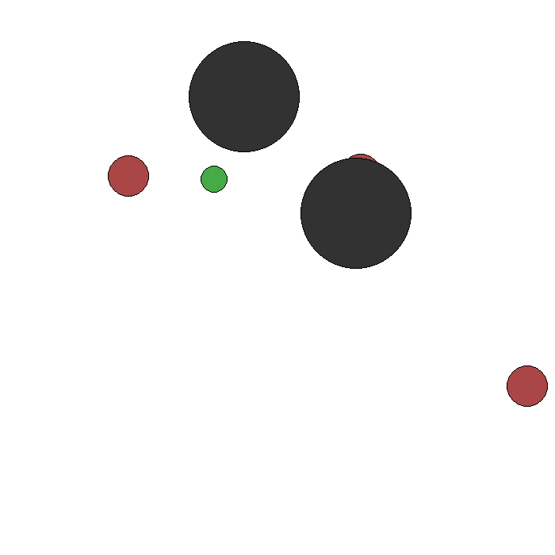

# MARL_Predator_Prey

Code and setup details adapted from https://github.com/Destiny000621/Predator-Prey-MARL. 


## Our Contributions:
1. **Ensemble Training:** Implemented methods for combined training techniques.
2. **Reward Shaping:** Developed and applied techniques to optimize learning incentives.
3. **Extensive Experimentation:** Conducted a series of experiments to evaluate performance differences:
   - **Comparative Training Algorithms:** Analyzed interactions between different algorithms, such as MADDPG vs. MADDPG, DDPG vs. MADDPG, and Random vs. Random.
   - **Varying Predator-Prey Ratios:** Tested scenarios with four predators and two prey, including adding file `MADDPG_prey` to adjust for this complexity.

## Setup Details:

### Install Python Environment

Install Python environment with conda:

```bash
conda create -n pp_env python=3.10 -y
conda activate pp_env
pip install -r requirements.txt
```

### How to Train Agents

Execute the following command to train the agents: (MADDPG for Predators and DDPG for Prey)

```bash
wandb login
python training_MADDPG.py
```

Provide your wandb API key when prompted. (Get one from https://wandb.com)

Our full-trained MADDPG models are saved in the `./MADDPG_DDPG_models` directory.

### How to Evaluate the Performances of Agents

Execute the following command to evaluate the performances of agents:

```bash
python evaluation.py
```

## Results


| Training Algorithm | Evaluation Results                                   |
|------------------|--------------------------------------------------------|
| RANDOM-RANDOM        |  ](res_gif/out32.gif) |
| DDPG-DDPG        |   |
| MADDPG-MADDPG      |  |
